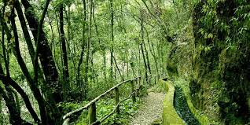
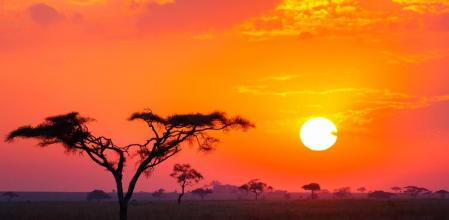
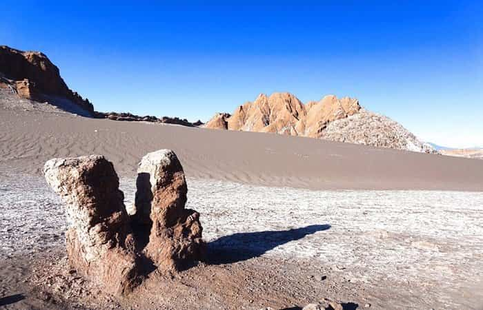
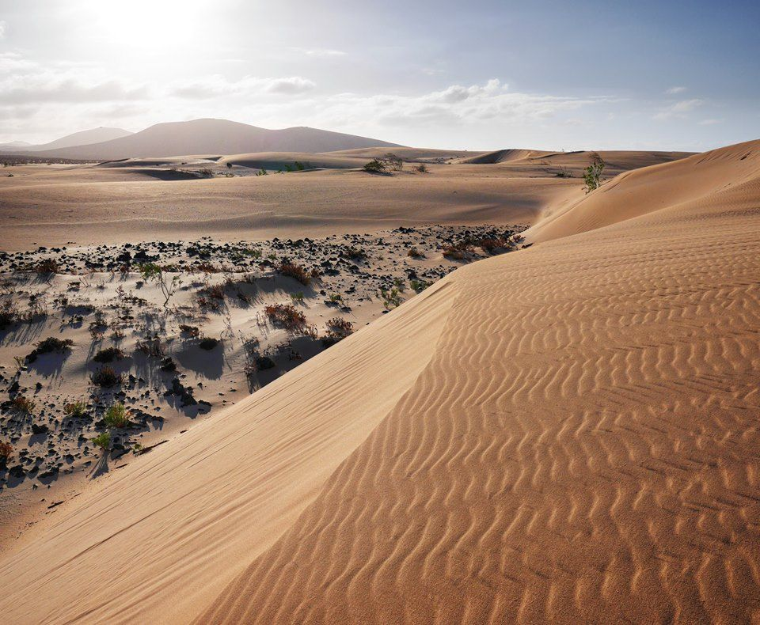
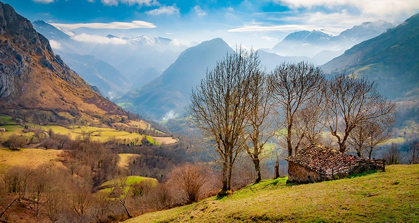
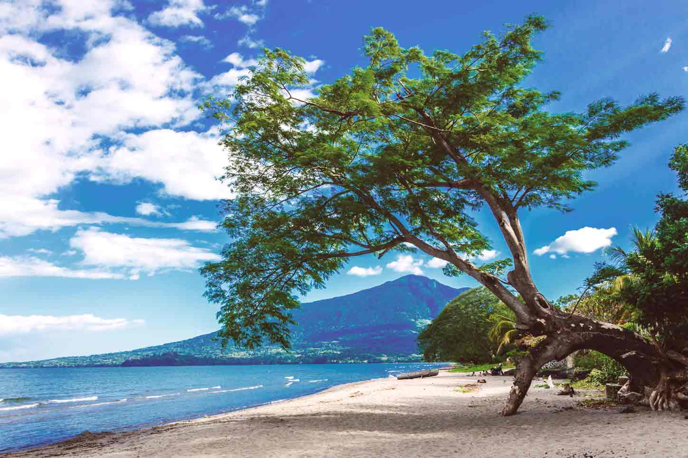
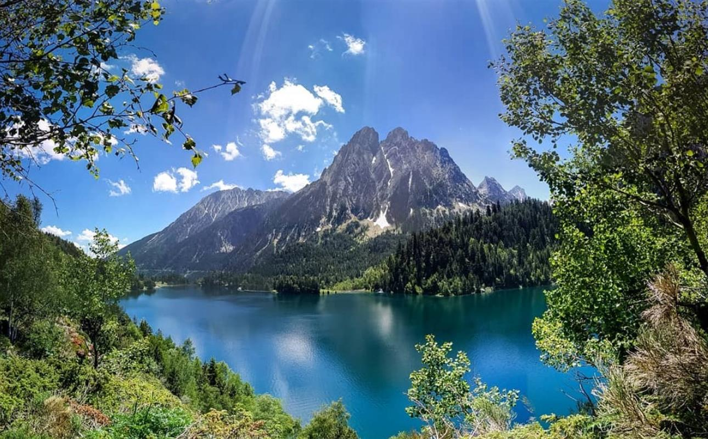

# FOTOS DE SARA CASTILLO
## Montaña nevada

 Los Alpes en invierno

## Bosque húmedo

Bosque del norte de españa

## Sabana

Puesta de sol en la sabana africana

## Paisaje desértico

Desierto rocoso

## Dunas

Paisaje de dunas

## Paisaje otoñal

Fotografía tomada en las montañas asturianas

## Playa

Paisaje marítimo con el mar en calma

## Bosque invernal

Bosque de abetos en invierno

## Lago

Lago entre montañas en Suiza

## Playa de ensueño

Destino de vacaciones soñado
